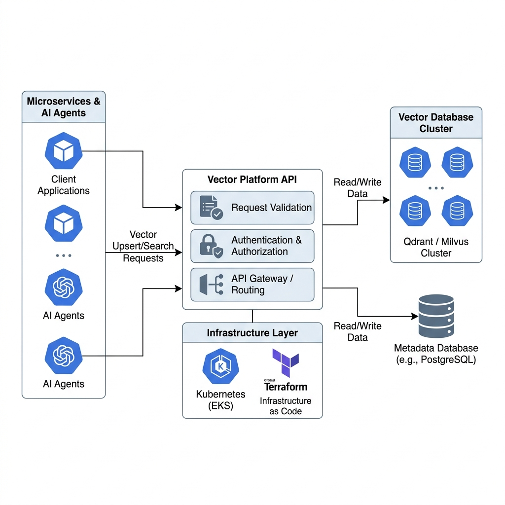
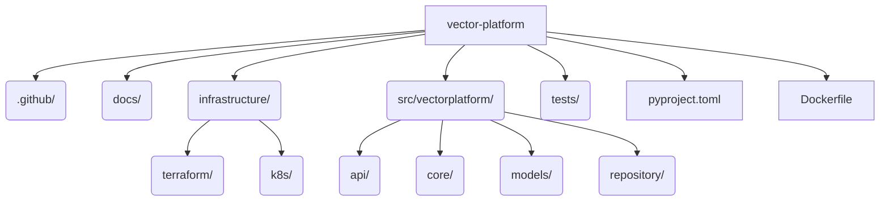

<div align="center">
  
</div>

<h1 align="center">Vector Platform</h1>

<p align="center">
  <strong>Enterprise Vector Database Abstraction</strong>
</p>

---

## 1. Executive Summary

In a sprawling ecosystem with multiple AI Agents, managing direct connections to Vector Databases (like Qdrant or Milvus) leads to security vulnerabilities, connection pooling issues, and tight coupling.

The **Vector Platform** is a Principal Engineer-grade platform layer. It abstracts the underlying vector database into a clean, authenticated API. It leverages an actual PostgreSQL database for metadata management (via SQLAlchemy) and communicates with Qdrant via the official client, all running on a scalable Kubernetes cluster managed by Terraform.

---

## 2. High-Level Design (HLD)

<div align="center">
  
  <br/>
  <em>Figure 1: Microservices routing upserts and searches through the central API, deployed on Kubernetes via Terraform, connecting to Postgres and Qdrant.</em>
</div>

### Operational Flow
1. **Infrastructure**: Terraform (`infrastructure/terraform/`) provisions the underlying EKS Cluster and AWS RDS instance.
2. **Orchestration**: Kubernetes manifests (`infrastructure/k8s/`) deploy the Docker container to the cluster, managing secrets and load balancing.
3. **Application**: The FastAPI app receives requests, validates them via Pydantic, queries PostgreSQL for collection metadata via SQLAlchemy, and routes vector operations to the Qdrant cluster.

---

## 3. Low-Level Design (LLD)

### 3.1 Tech Stack
* **Framework**: FastAPI (Python 3.12)
* **Data Access Layer**: SQLAlchemy 2.0 (Async), `qdrant-client`
* **Infrastructure**: Terraform, Kubernetes, Multi-stage Docker
* **Testing**: PyTest with in-memory SQLite and Qdrant simulations.

### 3.2 Folder Architecture



---

## 4. API Specification

### 4.1 Create Collection
```bash
curl -X POST http://localhost:8018/v1/collections \
  -H "Content-Type: application/json" \
  -d '{
    "name": "documents",
    "vector_size": 1536,
    "distance_metric": "Cosine"
  }'
```

### 4.2 Upsert Vector
```bash
curl -X POST http://localhost:8018/v1/vectors/upsert \
  -H "Content-Type: application/json" \
  -d '{
    "collection_name": "documents",
    "id": "835c6cd4-8846-4c7b-b8ce-33067cc23fc8",
    "vector": [0.12, -0.45, 0.89],
    "payload": {"text": "Hello world"}
  }'
```

### 4.3 Search
```bash
curl -X POST http://localhost:8018/v1/vectors/search \
  -H "Content-Type: application/json" \
  -d '{
    "collection_name": "documents",
    "vector": [0.12, -0.45, 0.89],
    "top_k": 5
  }'
```

---

## 5. Deployment

### Local Testing
```bash
docker-compose up -d --build
```

### Production
1. Apply Terraform: `cd infrastructure/terraform && terraform apply`
2. Apply K8s: `kubectl apply -f infrastructure/k8s/`

<hr>
<p align="center">
  <br>
  <i>Scalable AI Memory.</i>
  <br>
  <b><a href="https://devopstrio.com">© 2026 DevopsTrio Consulting. All rights reserved.</a></b>
</p>
